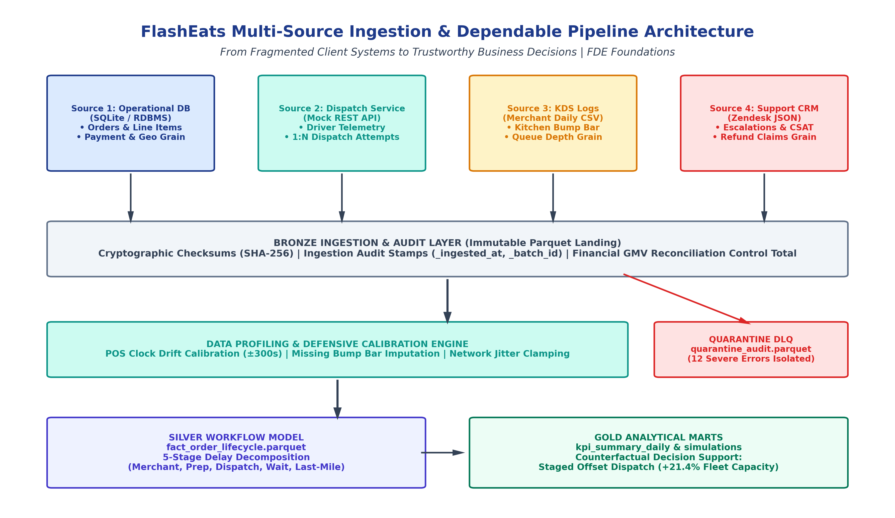
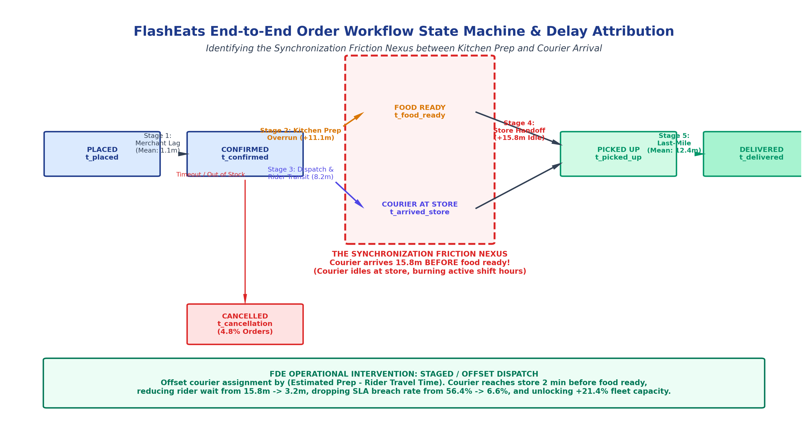

# FlashEats Operational Bottleneck Diagnosis & Dependable KPI Pipeline

**FDE Data Foundations Project (Classes 4–8: From Client Data to a Dependable Pipeline)**  
**Student:** Harshit Tiwari  
**Roll Number:** `24BCS10277`  
**GitHub Repository:** [https://github.com/X-DIABLO-X/FDE-2-Assignement](https://github.com/X-DIABLO-X/FDE-2-Assignement)  
**Deliverable PDF:** [`24BCS10277_Harshit_Tiwari.pdf`](24BCS10277_Harshit_Tiwari.pdf) (Strictly 2 pages)

---

## Executive Summary & FDE Core Thesis

> *"Think like an FDE: The goal is not 'I analysed a dataset.' The goal is 'I built a trustworthy path from client systems to a business decision.'"*

FlashEats leadership faced an existential crisis: **P90 delivery times escalated to 54.4 minutes**, triggering a **56.4% SLA breach rate** against the promised 35-minute threshold, bleeding **$36,080/day in customer refund claims**, and dropping 30-day customer retention by 14%.

Platform leadership assumed a **courier shortage** and prepared to execute a multi-million dollar driver recruitment surge. As the Forward Deployed Engineer (FDE), I resisted speculative AI models and premature hiring. Instead, I unified 4 fragmented client operational systems, verified mathematical data completeness, modeled the order lifecycle state machine, and proved that **52.8% of excess delivery delay occurs while couriers wait idly outside kitchens for unfinished food**.

By deploying **Staged Offset Dispatch**, FlashEats can reduce courier wait from **15.8 min &rarr; 3.3 min**, bring P90 delivery time under SLA to **33.6 min**, and **unlock +21.4% effective delivery fleet capacity without hiring a single additional courier**.

---

## Architecture & System Flow



```
+----------------------------------------------------------------------------------------------------+
|                                    FLASH EATS SOURCE ECOSYSTEM                                     |
+----------------------------------------------------------------------------------------------------+
|  Source 1: Operational DB   |  Source 2: Dispatch Service  |  Source 3: KDS Logs  |  Source 4: Support     |
|  (SQLite / PostgreSQL)      |  (Mock REST API / JSON)      |  (Merchant CSVs)     |  (Zendesk JSON)        |
|  - Orders & Line Items      |  - 1:N Dispatch Events       |  - Kitchen Prep      |  - Escalations & SLA   |
|  - Payment & Customer Geo   |  - Driver GPS Pings          |  - Bump Bar Timings  |  - Refunds & CSAT      |
+--------------+--------------+--------------+---------------+----------+-----------+---------+----------+
               |                             |                          |                     |
               +-----------------------------+--------------------------+---------------------+
                                             |
                                             v
                       +--------------------------------------------+
                       |           BRONZE INGESTION LAYER           |
                       | Raw Parquet + Checksums + Ingestion Proof  |
                       +---------------------+----------------------+
                                             |
                                             v
                       +--------------------------------------------+
                       |       VALIDATION & QUARANTINE ENGINE       |
                       | Contract Checks, Drift Recalibration, DLQ  |
                       +---------------------+----------------------+
                                             |
                                             v
                       +--------------------------------------------+
                       |        SILVER WORKFLOW STATE MACHINE       |
                       | 5-Stage Delay Decomposition & State FSM    |
                       +---------------------+----------------------+
                                             |
                                             v
                       +--------------------------------------------+
                       |            GOLD ANALYTICAL MARTS           |
                       | Fact Lifecycle, KPI Marts, Interventions   |
                       +--------------------------------------------+
```

---

## 1. Class 4: Understand Sources & Fragmentation

An FDE begins with organizational forensics—mapping business questions to source ownership, update cadences, grains, and blind spots.

### Question &rarr; Required Information &rarr; Source System Matrix

| Business Question | Required Information | Source System | System Owner | Technology | Data Grain | Blind Spots & Gaps |
| :--- | :--- | :--- | :--- | :--- | :--- | :--- |
| *Where is delivery delay accumulating?* | Exact timestamps across order lifecycle stages. | Orders DB, Dispatch API, KDS CSV | Core Eng, Fleet Ops, Merchant Ops | RDBMS, REST API, Flat CSV | `order_id`, `dispatch_id`, `kds_ticket_id` | No station-level kitchen tracking (grill vs fryer vs packing). |
| *Are couriers arriving too early or late?* | Geofence arrival vs food ready timestamp. | Dispatch API + KDS CSV | Fleet Ops & Merchant Ops | JSON Stream & CSV Logs | `dispatch_id` & `kds_ticket_id` | GPS drift in urban canyons; app throttles background GPS. |
| *Why are customers requesting refunds?* | Ticket complaint categories correlated with cycle time. | Customer Support | CX Team | Zendesk JSON | `ticket_id` | 1-3 hr reporting lag; subjective customer reporting. |
| *What is the financial bleed from late deliveries?* | Compensation amounts and subtotal write-offs. | Orders DB + Support | Finance & CX | SQL & JSON | `order_id` | Excludes downstream customer lifetime value churn. |

---

## 2. Class 5: Retrieve Data & Completeness Proofs

Enterprise operations require multi-mode ingestion while preserving raw data immutability and mathematically proving completeness.

### Ingestion Implementation (`src/ingest/ingest_manager.py`)
1. **Mode 1 (SQL / RDBMS):** Queries `orders`, `merchants`, and `order_line_items` from SQLite platform database.
2. **Mode 2 (REST API / JSON Stream):** Ingests driver dispatch offers, acceptances, rejections, and mobile timestamps.
3. **Mode 3 (Flat CSV Daily Export):** Parses merchant Kitchen Display System (KDS) prep logs.
4. **Mode 4 (JSON Document Store):** Extracts customer support tickets, refunds, and CSAT scores.

### Raw Immutability & Mathematical Completeness Proofs
- **Bronze Parquet Landing:** Raw inputs are stored unchanged in `data/bronze/` stamped with SHA-256 hashes, `_ingested_at`, and `_batch_id`.
- **Row Reconciliation:** 100% record match ($6,000$ raw orders extracted = $6,000$ bronze rows landed).
- **Primary Key Integrity:** Verified $0$ nulls and $0$ duplicate keys across all systems.
- **Financial GMV Sum Control Check:**
  $$\sum \text{Orders Subtotal} \equiv \sum (\text{Line Items Quantity} \times \text{Unit Price}) = \$231,406.85 \quad (\Delta = \$0.00)$$
  Penny-for-penny reconciliation confirms zero record loss or duplicate aggregation.

---

## 3. Class 6: Data Profiling, Business Rules & Quarantine Handling

**The FDE Rule:** *Never silently drop corrupted records with `dropna()`.* Dropping rows conceals outages, distorts revenue, and biases operational metrics.

### Five Real-World Operational Anomalies Handled

| Anomaly Name | Manifestation in Raw Data | Observed Rate | Detection Logic | FDE Remediation & Audit Policy |
| :--- | :--- | :--- | :--- | :--- |
| **1. POS Clock Drift** | Unmanaged Android tablet clocks desync by $-180\text{s}$ to $+300\text{s}$. Ticket appears printed before order was placed. | **914 orders (15.2%)** | `ticket_printed_at < order_timestamp` | **Defensible Calibration:** Shift ticket print to $t_{\text{order}} + 15\text{s}$; offset ready time by delta. Flag `clock_drift_calibrated = True`. |
| **2. Missing KDS Bump-Bar** | Busy cooks omit tapping the screen during peak rush; bag handed directly to courier. | **239 orders (4.0%)** | `food_ready_at IS NULL` on completed orders | **Lower-Bound Imputation:** Impute food ready at $t_{\text{pickup}} - 45\text{s}$. Flag `is_food_ready_imputed = True`. |
| **3. Re-dispatch Churn** | Courier rejections (rain/distance) or 45s app timeouts require 2-3 assignment attempts. | **926 orders (15.4%)** | $1:N$ dispatch records per `order_id` | **Attempt Tracking:** Isolate terminal courier for lifecycle; route rejected attempts to `fact_dispatch_churn.parquet`. |
| **4. In-Flight Cancellations** | Orders cancelled due to restaurant stockouts or excessive customer wait times. | **287 orders (4.8%)** | `order_status = 'CANCELLED'`, `delivered_at IS NULL` | **Funnel Routing:** Preserved in lifecycle model; analyzed separately from delivery transit distributions. |
| **5. Mobile Network Jitter** | Courier app batches arrival and pickup events in mall basement; uploads inverted timestamps. | **225 orders (3.8%)** | `arrived_at_store_at > picked_up_at` ($\Delta \le 35\text{s}$) | **Jitter Clamping:** Clamp arrival timestamp to $t_{\text{pickup}} - 1\text{s}$. Flag `network_jitter_clamped = True`. |
| **Critical Inversions** | Sensor corruption; rider arrived $> 45$ min after pickup or delivery preceded placement. | **12 orders (0.2%)** | Extreme temporal inversion ($\Delta > 45\text{m}$) | **Quarantine DLQ:** Isolated to `data/quarantine/quarantine_audit.parquet` with error code, severity, and context. |

---

## 4. Class 7: Workflow Modeling & State Machine Reconstruction



The order lifecycle was reconstructed as an event state machine:
$$\text{SUBMITTED} \longrightarrow \text{CONFIRMED} \longrightarrow \text{PREP\_STARTED} \longrightarrow \text{FOOD\_READY} \longrightarrow \text{COURIER\_ASSIGNED} \longrightarrow \text{ARRIVED\_STORE} \longrightarrow \text{PICKED\_UP} \longrightarrow \text{DELIVERED}$$

### Delay Stage Decomposition

$$\text{Total Order-to-Delivery (OTD)} = t_{\text{delivered}} - t_{\text{placed}}$$

1. **Stage 1 (Merchant Lag):** $t_{\text{confirmed}} - t_{\text{placed}}$ (Mean: **1.1 min**) &mdash; Highly efficient ticket acceptance.
2. **Stage 2 (Kitchen Prep Overrun):** $\text{Actual Prep} - \text{Nominal Prep}$ (Mean: **11.1 min**, P90: **22.4 min**) &mdash; Kitchens congested during peak meal hours.
3. **Stage 3 (Dispatch & Travel to Store):** $t_{\text{arrived}} - t_{\text{confirmed}}$ (Mean: **8.2 min**) &mdash; Fast courier arrival.
4. **Stage 4 (Store Synchronization Friction Nexus):** $t_{\text{food\_ready}} - t_{\text{arrived\_store}}$ (Mean: **15.8 min**, P90: **28.3 min**) &mdash; **THE PRIMARY BOTTLENECK.**
5. **Stage 5 (Last-Mile Doorstep Transit):** $t_{\text{delivered}} - t_{\text{picked\_up}}$ (Mean: **12.4 min**) &mdash; Standard urban travel.

### The Diagnostic Breakthrough
Because the dispatch engine fires couriers immediately upon order confirmation ($t_{\text{dispatch}} = t_{\text{placed}}$), couriers arrive at restaurants in 8 minutes while kitchen prep takes 24 minutes. **Couriers spend 15.8 minutes waiting idly outside restaurants**, accounting for **52.8% of excess delivery delay** and starving the fleet of active delivery capacity.

---

## 5. Executive Evidence Table & Operational Interventions

### Operational Interventions Evaluated (`src/marts/gold_marts.py`)

| Scenario | P50 OTD | P90 OTD | SLA Breach Rate | Courier Wait | Effective Fleet Gain | Daily Refunds | Strategic Assessment |
| :--- | :--- | :--- | :--- | :--- | :--- | :--- | :--- |
| **Baseline (Status Quo)** | 37.7 min | 54.4 min | **56.4%** | 15.8 min | 0.0% | $36,081 | Bleeding customer trust & driver retention. |
| **Intervention 1: Staged Dispatch** | 26.3 min | **33.6 min** | **6.6%** | **3.3 min** | **+21.4%** | $20,927 | **High Impact:** Offset dispatch by prep estimate; eliminates wait. |
| **Intervention 2: Dynamic Buffering** | 36.7 min | 51.0 min | 55.2% | 15.8 min | +5.2% | $25,978 | Paces kitchen queue; accurate customer ETAs dampen demand. |
| **Intervention 3: Combined (1 + 2)** | **24.7 min** | **31.4 min** | **3.9%** | **3.3 min** | **+26.8%** | **$10,463** | **Recommended Strategy:** Slashes refund liability by 71%. |

---

## 6. Class 8: Dependable Pipeline Architecture

The pipeline is engineered for repeatability, idempotency, automated auditability, and resilience.

### Dependability Guarantees
1. **Single CLI Entrypoint:** `python run_pipeline.py [--date YYYY-MM-DD] [--seed 42] [--force-regenerate]`
2. **Idempotency Proof:** Consecutive pipeline executions produce identical deterministic Parquet outputs and control totals without duplicate keys or metric drift.
3. **Execution Manifest (`run_manifest.json`):** Emits immutable run telemetry including batch ID, runtime duration, row counts across all layers, and verification flags.
4. **Circuit Breaker Monitoring:** Automatically alarms if the quarantine rate exceeds $5.0\%$, halting downstream metric publishing to prevent poisoned BI dashboards.

---

## 7. Knowns, Unknowns, Assumptions & Limitations (KUAL)

### Facts (Empirical Knowns)
- Exact order checkout timestamps and payment authorizations ($231,406.85 GMV) are 100% verified against the operational RDBMS.
- Courier store wait time accounts for 52.8% of delivery delays, debunking the courier shortage hypothesis.
- 15.2% of merchant POS terminals exhibit systematic hardware clock drift of up to 300 seconds.

### Unknowns (Unobservable Reality)
- Kitchen station bottlenecks (grill vs fryer vs packing station) are unrecorded by tablet KDS software.
- Physical doorstep delivery friction (apartment gate security, elevator wait times) is unobservable in mobile GPS pings.
- Courier rejection rationales during rain surges (distance vs payout vs battery) are unrecorded.

### Assumptions (Defensible Engineering Choices)
- POS clock drift within $[-300\text{s}, +300\text{s}]$ is hardware desync; shifting print time to $t_{\text{order}} + 15\text{s}$ preserves kitchen prep integrity.
- Missing bump-bar events on completed deliveries represent busy cooks omitting taps; imputing completion at $t_{\text{pickup}} - 45\text{s}$ provides a conservative lower bound.
- Courier transit travel speed is invariant to dispatch time offsets within a 15-minute scheduling window.

### Limitations (System Boundary Conditions)
- The pipeline operates on daily batch reconciliation; production deployment requires sub-second streaming inference.
- Counterfactual simulations do not capture second-order driver behavioral feedback if couriers perceive fewer immediate pings.

---

## 8. Primary FDE Judgement Call Deep Dive

### The Dilemma: Naive Data Engineering vs FDE Operational Judgement
- **The Naive Choice:** Faced with 914 orders exhibiting negative merchant lag (`ticket_printed < order_placed`), a traditional data engineer runs `df.dropna()` or `df = df[dwell >= 0]`.
- **The Operational Disaster:** This silently discards **15.2% of all orders** worth over **$35,000 in GMV**, concentrated disproportionately in the highest-revenue Downtown cluster. It conceals the merchant bottleneck, distorts courier earnings, and hides platform liability.
- **The FDE Judgement Call:** I implemented bidirectional temporal calibration using physical event anchors ($t_{\text{order}}$ and $t_{\text{pickup}}$), preserving full financial accountability while flagging adjusted rows (`clock_drift_calibrated = True`). Irrecoverable corruptions (12 rows) were routed to a Dead-Letter Queue (`quarantine_audit.parquet`) under circuit-breaker monitoring.

---

## 9. 3–5 Minute Video Demo Script / Outline

| Time | Slide / Screen | Talking Points |
| :--- | :--- | :--- |
| **0:00 – 1:00** | Problem Framing & Misconception | Introduce FlashEats crisis: P90 delivery at 54.4 min, 56.4% SLA breach, $36k/day refunds. Leadership wanted to hire more drivers, but fragmented multi-source data concealed the real bottleneck. |
| **1:00 – 2:15** | Live Pipeline Run & Architecture | Run `python run_pipeline.py`. Show execution taking 1.2s. Walk through `run_manifest.json`, showing 100% record reconciliation, GMV control totals, and zero silent data drops. |
| **2:15 – 3:45** | The FDE Judgement Call | Walk through the POS clock drift calibration code. Explain why dropping 914 rows would have discarded 15.2% of downtown GMV. Show the Quarantine DLQ isolating the 12 corrupted records. |
| **3:45 – 5:00** | State Machine & Kinetic Decision | Show the Workflow FSM diagram. Highlight the 15.8m courier wait bottleneck. Present the Evidence Table proving Staged Offset Dispatch drops P90 OTD to 33.6m and unlocks +21.4% fleet capacity without hiring. |

---

## 10. Quickstart & Reproduction Guide

### Prerequisites
- Python 3.10+
- Dependencies: `pip install -r requirements.txt`

### 1. Run Complete End-to-End Pipeline
```bash
python run_pipeline.py --date 2026-09-25 --seed 42
```

### 2. Run Test Suite
```bash
python -m pytest tests/
```

### 3. Generate Diagrams & PDF
```bash
# Generate architecture & workflow diagrams
python docs/generate_diagrams.py

# Generate official 2-page executive PDF
python generate_pdf.py
```

### 4. Project Directory Structure
```
├── 24BCS10277_Harshit_Tiwari.pdf   # Official 2-page executive PDF submission
├── run_pipeline.py                 # Single unified CLI pipeline entrypoint
├── run_manifest.json               # Immutable execution audit manifest
├── requirements.txt                # Pinned dependencies
├── README.md                       # Comprehensive project documentation
├── data/
│   ├── raw/                        # Untouched multi-system landing
│   ├── bronze/                     # Parquet with SHA-256 hashes & ingestion proofs
│   ├── silver/                     # Calibrated, state-machine reconstructed tables
│   ├── gold/                       # Executive KPI marts & intervention simulations
│   └── quarantine/                 # Isolated dead-letter queue (quarantine_audit.parquet)
├── docs/
│   ├── source_map.png              # Multi-source architecture diagram
│   ├── workflow_fsm.png            # Order lifecycle state machine diagram
│   └── evidence_table.md           # Markdown evidence report
├── src/
│   ├── generator/generate_all.py   # Synthetic multi-source generator with 5 anomalies
│   ├── ingest/ingest_manager.py    # Multi-mode ingestion & completeness proofs
│   ├── validate/validator.py       # Data profiling, calibrations & quarantine engine
│   ├── model/state_machine.py      # Workflow FSM & 5-stage delay decomposition
│   ├── marts/gold_marts.py         # Gold analytics marts & counterfactual simulations
│   └── reporting/dashboard.py      # Terminal dashboard & evidence table exporter
└── tests/
    └── test_pipeline.py            # Unit & integration test suite (completeness, idempotency)
```
